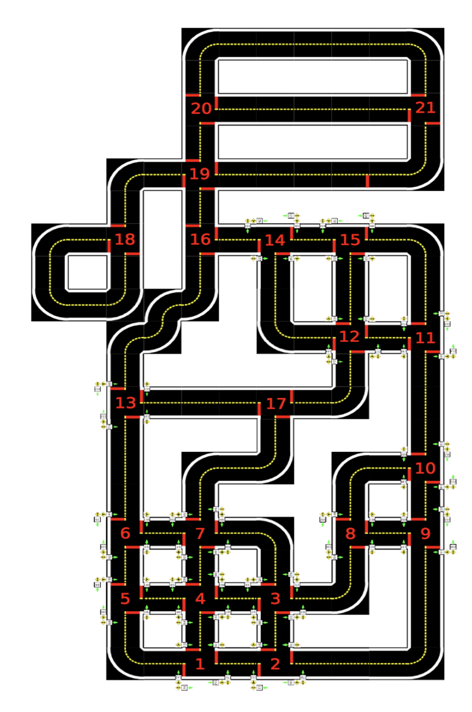

# gym-duckienav

The example is modifed from the Taxi Problem in "Hierarchical Reinforcement Learning with the MAXQ Value Function Decomposition" by  Tom Dietterich (2000), Journal of Artificial Intelligence Research.

This is used in the Duckietown summer school 2018, Introduction to AI (Robotics) 2019.
https://github.com/OpenPPAT/ai-course-2019/blob/master/04-jupyter-taxi-problem/04-jupyter-taxi-problem.ipynb



```
MAP = [
    "+-----------------+",
    "|O|O| : : : : :G: |",
    "|O|O| |O| |O| |O| |",
    "|O| : |O| |O| |O| |",
    "| : |O|O| : : : : |",
    "| |O|O|O|O|O| |O| |",
    "| : :R: : : : |O| |",
    "| |O|O|O| |O|O|O| |",
    "| |O| : : |O| : : |",
    "| |O| |O|O|O|B|O| |",
    "| : : : : : : |O| |",
    "| |O| |O| |O| |O| |",
    "| : : : : : : |O| |",
    "| |O| |O| |O|O|O| |",
    "| : : :Y: : : : : |",
    "+-----------------+",
]

```
